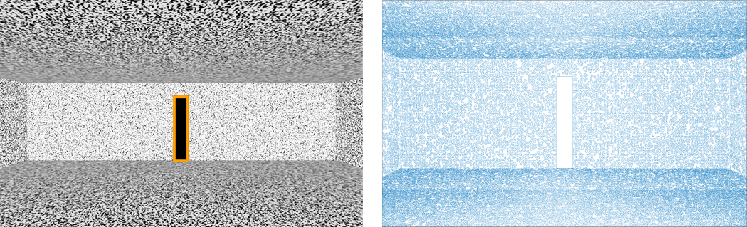

# Comparing the richness of optic flow in the four virtual environments

## Overview of the pipeline

* __Dot sampling__ is to sample dots from the visual elements in the virtual environment. Based on the position of these dots, flow vectors are calculated.
* __Flow vector calculation__ is to calculate the flow vectors from the sampled visual dots. Specifically, the vectors were calculated as the projection of the relative motion of the dots on the retina of a moving viewer.
* __Translational field__ and __Translational + rotational field__: depending on whether the viewer is fixating on the target or not during the movement, two types of flow fields were calculated here. **Translational field** is calculated for a pure translation of the viewer with the gaze fixed at the moving direction. __Translational and rotational field__, however, is calculated for the situation that the viewer is moving in a direction away from the target but the gaze is fixed at the target.
  - From the __translational field__, we calculated a __speed gradient__ on the speed of the flow vectors in the field.
  - From the __translational and rotational field__, we calculated the number of pairs of dots that could form __motion parallax__ for each virtual environment, according to the definition by [Longuet-Higgins & Prazdny, 1980](https://royalsocietypublishing.org/doi/abs/10.1098/rspb.1980.0057).

`Batch_Calculation.m` runs the pipeline for all the virtual environments.

## Details of each step in the pipeline

### Dot sampling
For each virtual environment, there is a folder that includes the code for sampling the dots in this virtual environment, `DotSampling.m`.  Running the code will yield a .csv file that records the position of each sampled dot in the world coordinate with the original point at the starting point (7m from the target) in the actual experiment. It will also generate a .mat file that contains the position of the sampled dots relative to the viewer (6m from the target) in this analysis.

#### Line

The visual dots are sampled along four edges of the image of target post projects on the 2D plane at the starting point (i.e., top, bottom, left and right). The dots are labeled according to the direction of the line (i.e., horizontal or vertical) that they are sampled from.

#### Outline

The visual dots are sampled along the lines that constitute the whole outline of the room. As in the _Line_ condition, the dots are labeled according to the direction of the line (i.e., horizontal or vertical) that they are sampled from.

#### Room

The visual dots are sampled along the black-white edges on the random-noised pattern of the wall texture. The image file of the texture is `wallTex_Brightened.jpg`, contained in the 'Room' folder. MATLAB function `edge` (using the Canny method) is used for extracting the black-white edges on the texture pattern.

#### Cloud

The sampled dots for the *Cloud* condition contain two groups. One group contains the sampled dots from the target post, which is calculated in the same way as for the *Line* condition. The other group contains the dots that constitute the cloud. In the experiment, there were a total of 5250 dots in the cloud. Each dot had a limited lifetime of 500ms. Following a protocol similar to [Foulkes, Rushton and Warren, 2013](https://www.frontiersin.org/articles/10.3389/fnbeh.2013.00053/full#B11) and an estimate of visual persistence of around 100ms ([Di Lollo, 1980](https://psycnet.apa.org/record/1981-06942-001)), it is estimated perception of 20% more dots than were presented on any single frame. Therefore, a total of 6300 dots were created for the analysis.

### Flow vector calculation
To calculate a flow field for each virtual environment, movement of a viewer is simulated. The viewer stands at 6m from the target, and moves towards the target at 1 m/s. There is a 10&deg; horizontal offset between the movement direction and the target. The eye-height of the viewer is 1.5m.

 `Cal_Image_Vectors.m` calculates the flow vector for each sampled dot based on its position relative to the viewer in the 3D space ([ , , ]).
 1. Each dot projects an image on the retina of the viewer. This image position ([ ,  ]) is calculated following the equations below:

 <!--  -->

  .

2. A flow vector ([ ,  ]) is calculated for each dot, following the equations below:

  

  where  is the focal length,  is the transitional velocity of the viewer ( [ , ,  ]), and  is the rotational velocity of the viewer ([ , ,  ]).

  Here, we make  to be 1 for convenience. As the viewer does not have any rotational movement around x-axis (pitch) or z-axis (roll), both  and  are 0.

  When the viewer walks with the gaze fixed on the target, we have ,  = 0 for ,  = 0, and
  

    .
  

  Therefore,
  

    ,
  

  where  is the inverse depth, . When there is only translation,  = 0.

  Combining the equations above, we have
  

    
  

  ### Calculation of flow fields
  `Cal_Flow_Info.m` calls `Cal_Image_Vectors` and calculates both the pure __translational flow field__ and __translational + rotational flow field__ for the specific virtual environment.

  For sampled dots that are along a horizontal or vertical line in the _Line_ and _Outline_ conditions, their velocity is restricted to the direction perpendicular to the line.

  Distribution of the magnitude of the velocity is plotted.

  ### Calculation of __speed gradient__
  `Cal_Quartiles.m` calculates the speed quartile for a specific condition. It is called in `Batch_Calculation.m`. The quartile data is saved in 'quartiles.csv', and then visualised in `PlotQuartiles.R`.

  ### Calculation of __motion parallax__
  Motion parallax is calculated and plotted by calling `Cal_motion_parallax_local_differential.m` in `Cal_Flow_Info.m`.

  A searchlight method is used to find pairs of dots that can potentially form motion parallax in the field.

  For a sampled dot, any dot with a distance shorter than a closeness threshold (e.g., 0.2&deg; 0.28&deg;) is considered as overlapping with the dot on the image plane, forming a potential pair of motion parallax dots. However, if the two dots are on the same depth, they will not be considered as a valid motion parallax dots. In addition, the motion parallax pairs between dots on the target post and dots on the other visual elements are not considered.

  After determining the potential motion parallax dot pairs, vector difference between their image velocity is calculated for each pair. If the magnitude of the velocity difference is lower than a threshold (0.02m/s or 5% - Weber factor - of the larger speed within the pair), the pair is not considered as a valid motion parallax pair.
